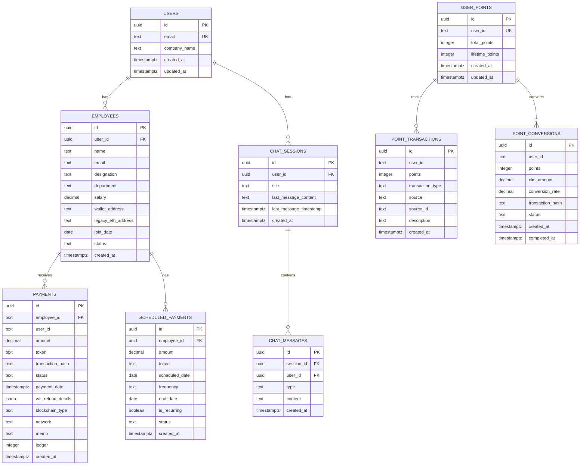

# 🌍 Gemetra

**Global Remittance Infrastructure for VAT Refunds & Payroll**  
Wallet-native. AI-powered. Borderless. Built on Stellar with XLM.

## 🎥 Demo Video

<p align="center">
  <a href="https://youtu.be/FEmaygRs1gs" target="_blank" rel="noopener noreferrer">
    
  </a>
</p>

*Click the thumbnail above to watch the demo video on YouTube*


---

## 🚀 Overview

**Gemetra** is an **on-chain VAT Refund & Payroll Payment Infrastructure** built on the **Stellar blockchain**.

Using **XLM** (Stellar Lumens), the native cryptocurrency of the Stellar network, this platform enables:

1. **VAT Refunds** – Tourists submit refund requests → receive instant XLM payments on Stellar.
2. **VAT Admin Panel** – Government VAT employees can view, filter, and export all VAT refund claims with complete details (receipt info, personal info, merchant info, payment details).
3. **Payroll Automation** – Employers upload CSV → AI computes salaries → employees receive XLM payments instantly.
4. **Scheduled Payments** – Automate recurring and one-time payments with calendar view and pre-approval system.
5. **Points & Rewards** – Earn points for transactions and convert to XLM tokens.
6. **AI Assistant** – Get instant answers about payroll, payments, and blockchain technology.

---

## 🛑 Problem

- **Tourist VAT Refunds** are slow, manual, and often unclaimed due to airport delays ($50B+ lost annually).
- **Global Payroll** is plagued by high fees (2-5%), delayed wires (3-5 days), hidden FX costs, and compliance overhead.
- Both processes rely on **centralized, fragmented rails** that fail in a borderless world.

---

## ✅ Solution

**Gemetra** provides a **wallet-native remittance infrastructure** where:
- Tourists **receive VAT refunds** instantly in XLM on Stellar.
- Employers **disburse payroll globally** with a single transaction.
- **Automated scheduled payments** for recurring payroll and one-time future payments.
- **Points system** rewards users for transactions and converts to XLM.
- Stellar blockchain ensures **transparency**, **speed** (3-5 second confirmations), and **low fees** (0.00001 XLM per transaction).

---

## ⚡ System Architecture

```mermaid
flowchart TB
    subgraph "Client Layer"
        WEB["🌐 Web App<br/>(React + Vite)"]
        MOBILE["📱 Mobile<br/>(Responsive)"]
        WALLET["💼 Wallets<br/>(Freighter/Albedo)"]
    end

    subgraph "Application Layer"
        UI["🎨 UI Components<br/>(Dashboard, Forms, Modals)"]
        HOOKS["🪝 React Hooks<br/>(usePayments, useEmployees, usePoints)"]
        SERVICES["⚙️ Services<br/>(AI, Payment, Price)"]
    end

    subgraph "Backend Services"
        SUPABASE["🗄️ Supabase<br/>(PostgreSQL + Storage)"]
        AI["🤖 AI Service<br/>(Google Gemini)"]
        EMAIL["📧 Email Service<br/>(EmailJS)"]
    end

    subgraph "Blockchain Layer"
        STELLAR["⛓️ Stellar Network<br/>(Mainnet/Testnet)"]
        XLM["💰 XLM<br/>(Native Token)"]
        WALLETKIT["🔌 Stellar Wallets Kit<br/>(Wallet Integration)"]
    end

    subgraph "External Services"
        EXPLORER["🔍 Stellar Expert<br/>(Tx Verification)"]
        PRICE["💵 Price API<br/>(Crypto Prices)"]
    end

    WEB --> UI
    MOBILE --> UI
    UI --> HOOKS
    HOOKS --> SERVICES
    SERVICES --> SUPABASE
    SERVICES --> AI
    SERVICES --> EMAIL
    HOOKS --> WALLETKIT
    WALLETKIT --> WALLET
    WALLET --> STELLAR
    STELLAR --> XLM
    STELLAR --> EXPLORER
    SERVICES --> PRICE
    EXPLORER --> UI
```



---

## 📊 Database Schema



---

## 💸 Payment Flow (Bulk Payroll)


---

## 🧾 VAT Refund Flow


---

## 📅 Scheduled Payments Flow


---

## 🎁 Points System Flow


---

## 🏛️ VAT Admin Panel Flow


---

## 🤖 AI Assistant Flow


---

## 🏗️ Component Architecture


---

## 🔮 Features

- **Wallet-Native UX**: Connect any Stellar wallet → confirm → receive XLM.
- **Tourism-Grade Simplicity**: Refunds in 3 steps → Upload → Review → Confirm.
- **VAT Admin Dashboard**: 
  - Wallet-based access control for authorized government employees
  - View all VAT refunds with complete details (receipt, personal, merchant, payment info)
  - Filter by status, date, and search by address/ID/transaction
  - Export all data to CSV for compliance and reporting
  - Real-time updates with auto-refresh every 5 seconds
- **Enterprise Payroll**: AI-driven salary parsing and bulk XLM payouts.
- **Scheduled & Recurring Payments**: 
  - Schedule one-time or recurring payments (daily, weekly, bi-weekly, monthly)
  - Calendar view to visualize all scheduled payments
  - Pre-approval system for automatic processing without wallet popups
  - Auto-process payments within pre-approved spending limits
- **Points & Rewards System**:
  - Earn points for every transaction (10 points per payment, 15 for VAT refunds)
  - Convert 100 points = 1 XLM token
  - Complete transaction history
- **AI Assistant**:
  - 65+ pre-loaded questions
  - Real-time crypto price information
  - Company and payroll insights
  - Chat history persistence
- **Transparency**: All transactions on Stellar blockchain with public audit trail.
- **Compliance Ready**: Supabase logs + JSON/CSV exports for regulators and finance teams.
- **VAT Refund Details Storage**: All form data (VAT reg number, receipt number, passport, flight, merchant info, etc.) stored in JSONB column for complete audit trail.
- **Stellar Integration**: Built on Stellar for fast (3-5 second) confirmations and low fees (0.00001 XLM per transaction).

---

## 🛠️ Tech Stack

- **Blockchain**: Stellar (Mainnet/Testnet)
  - XLM (Stellar Lumens) - Native cryptocurrency
  - Fast confirmations (3-5 seconds)
  - Low fees (0.00001 XLM per transaction)

- **Wallet Integration**: Stellar Wallets Kit
  - Supports Freighter (browser extension) and Albedo (web-based)
  - Mobile-first signing with QR scan/deep link support
  - Custom wallet selection modal

- **AI Layer**: Google Gemini
  - Natural language processing for payroll insights
  - Real-time crypto price information
  - Company financial analysis

- **Backend**: [Supabase](https://supabase.com/)
  - Postgres DB, object storage, user audit logs, and compliance artifacts
  - Row Level Security (RLS) for data protection

- **Frontend**: React + Vite
  - Modern UI with Tailwind CSS and Framer Motion
  - Responsive design for mobile and desktop

- **Transaction Verification**: Stellar Expert
  - Real-time transaction tracking and verification

---

## 📡 Data Flow


1. **Input**
   - VAT Refunds: Retailer receipts, passport/KYC snapshots.
   - Payroll: Employer CSV with gross pay data.

2. **Processing**
   - AI parses salaries, deductions, taxes.
   - AI validates VAT eligibility & calculates refunds.

3. **Persistence**
   - Supabase stores invoices, payruns, logs, validation proofs.

4. **Execution**
   - API creates XLM payment transaction → wallet signs & submits to Stellar.
   - Stellar network executes native payment operations.

5. **Finality**
   - Stellar confirms transactions (3-5 seconds).
   - Stellar Expert verifies results.
   - Supabase logs for audit.

6. **Audit**
   - Export JSON/CSV/PDF reports for regulators & enterprise compliance.

---

## 🔐 Security & Compliance

- **Wallet-Based Auth**: No passwords, wallet addresses as user IDs
- **Row Level Security**: Supabase RLS policies ensure data isolation
- **Transaction Verification**: All transactions verified on Stellar Expert
- **Immutable Audit Trail**: Supabase DB + Stellar tx hashes provide verifiable record-keeping
- **Circuit Breakers**: Pre-approval limits prevent unauthorized large payments
- **Data Encryption**: All sensitive data encrypted at rest and in transit

---

## 💰 Business Model

- **Platform Fees**: 0.5% per payout (tourist refund / payroll).
- **Enterprise SaaS**: Subscription-based dashboards & compliance exports for HR/finance teams.
- **Partnership Revenue**: Integration fees with VAT Operators & HR SaaS providers.
- **Future Yield**: Earn yield on idle treasury balances + capture micro-spreads on FX conversions.

---

## 📈 Go-To-Market (GTM)

- **Phase 1 – Tourism**:
  Pilot deployment at major airports with VAT operator integration.

- **Phase 2 – Payroll**:
  Target **DAOs, Web3 startups, and SMEs** with XLM-based payroll rails on Stellar.

- **Phase 3 – Enterprise Expansion**:
  Partner with **multinationals** and expand VAT refunds to EU, UK, Singapore, and Saudi Arabia.

- **Phase 4 – DAO Governance**:
  Transition to community-driven governance of refund % rates, fee splits, and expansion markets.

---

## 🔮 Roadmap

- ✅ **MVP**: Wallet-native VAT refunds + CSV-based payroll automation with XLM.
- ✅ **Scheduled Payments**: Calendar view, recurring payments, and pre-approval system.
- ✅ **Points System**: Earn points for transactions, convert to XLM.
- ✅ **AI Assistant**: Natural language interface for payroll and crypto questions.
- ✅ **VAT Admin Panel**: Government dashboard for viewing, filtering, and exporting all VAT refund claims with complete details.
- ✅ **Stellar Migration**: Migrated from Ethereum/MNEE to Stellar/XLM for faster transactions and lower fees.
- 🔄 **Next**: Multi-country VAT support + AI-driven tax compliance engine.
- 🔄 **Later**: Enterprise integrations, PDF-based compliance exports, multi-signature approvals.
- 🌐 **Future**: Gemetra DAO + full protocol governance.

---

## 🌟 Why Stellar?

Gemetra leverages the unique advantages of the Stellar blockchain:

- **Lightning Fast**: 3-5 second transaction confirmations vs Ethereum's minutes.
- **Ultra-Low Fees**: 0.00001 XLM (less than $0.0001) per transaction vs variable gas fees.
- **Native Payments**: XLM transfers don't require smart contracts, simplifying integration.
- **Built for Payments**: Stellar was designed specifically for cross-border payments and remittances.
- **Global Reach**: Stellar's network effects enable true borderless payments.
- **Developer-Friendly**: Simple APIs and SDKs make integration straightforward.
- **Transparency**: All transactions publicly verifiable on Stellar blockchain.
- **Proven at Scale**: Handles millions of transactions daily with 99.99% uptime.

---

## 🔄 Migration from Ethereum to Stellar

**Gemetra has migrated from Ethereum/MNEE to Stellar/XLM** to provide users with faster transactions and significantly lower fees.

### What Changed?

- **Blockchain**: Ethereum → Stellar
- **Token**: MNEE (ERC-20) → XLM (Native)
- **Wallets**: MetaMask/WalletConnect → Freighter/Albedo
- **Transaction Speed**: Minutes → 3-5 seconds
- **Transaction Fees**: Variable gas fees → 0.00001 XLM fixed
- **Block Explorer**: Etherscan → Stellar Expert

### What Stayed the Same?

- All features remain fully functional
- Your account data and payment history are preserved
- The user interface and experience are largely unchanged
- Points system and rewards continue to work

### Action Required

**Employee Wallet Addresses**: If you have existing employees, you'll need to update their wallet addresses from Ethereum format (0x...) to Stellar format (G...). The old addresses are preserved in a legacy field for reference.

**Getting Started with Stellar**:
1. Install [Freighter wallet](https://www.freighter.app/) (browser extension) or use [Albedo](https://albedo.link/) (web-based)
2. Create or import your Stellar account
3. Get some XLM from an exchange or use the [Stellar testnet](https://laboratory.stellar.org/#account-creator?network=test) for testing
4. Connect your wallet to Gemetra and start making payments

For detailed setup instructions, see our [Stellar Setup Guide](docs/STELLAR_SETUP.md).

---

## 🏆 Original Hackathon Project

This project was originally built for the **MNEE Hackathon: Programmable Money for Agents, Commerce, and Automated Finance** using MNEE stablecoin on Ethereum. It has since been migrated to Stellar for improved performance and lower costs.

**Original Hackathon Alignment**:
✅ **Uses MNEE Stablecoin**: Contract address `0x8ccedbAe4916b79da7F3F612EfB2EB93A2bFD6cF`  
✅ **Commerce & Creator Tools Track**: VAT refunds and payroll checkout systems  
✅ **Financial Automation Track**: Programmable invoicing and automated payroll  
✅ **AI & Agent Payments**: AI-powered salary computation and payment automation  

---

## 📦 Installation

```bash
# Install dependencies
npm install
# or
pnpm install

# Set up environment variables
cp .env.example .env
# Add your Supabase credentials and API keys

# Run development server
npm run dev
# or
pnpm dev

# Build for production
npm run build
# or
pnpm build
```

---

## 🔧 Configuration

### Environment Variables

Create a `.env` file in the root directory with the following variables:

#### Required Variables

```env
# Supabase (Required for data persistence)
VITE_SUPABASE_URL=your_supabase_url
VITE_SUPABASE_ANON_KEY=your_supabase_anon_key

# Stellar Network (Required for blockchain operations)
VITE_STELLAR_NETWORK=testnet  # or 'mainnet' for production
VITE_HORIZON_URL=https://horizon-testnet.stellar.org  # or https://horizon.stellar.org for mainnet
```

#### Optional Variables

```env
# Gemini AI (Optional - for AI assistant features)
VITE_GEMINI_API_KEY=your_gemini_api_key

# EmailJS (Optional - for email notifications)
VITE_EMAILJS_PUBLIC_KEY=your_emailjs_public_key
VITE_EMAILJS_SERVICE_ID=your_emailjs_service_id
VITE_EMAILJS_TEMPLATE_ID=your_emailjs_template_id
```

**Quick Setup:**
1. Copy `.env.example` to `.env` (if available)
2. Fill in the required variables (Supabase and Stellar)
3. Add optional variables if you want AI or email features
4. Restart the dev server: `npm run dev`

**See `docs/ENVIRONMENT_SETUP.md` for detailed setup instructions.**

### Stellar Network

The application supports both Stellar Mainnet and Testnet:

- **Mainnet**: Production environment with real XLM
  - Horizon URL: `https://horizon.stellar.org`
  - Network Passphrase: `Public Global Stellar Network ; September 2015`

- **Testnet**: Development environment with free test XLM
  - Horizon URL: `https://horizon-testnet.stellar.org`
  - Network Passphrase: `Test SDF Network ; September 2015`
  - Get free test XLM from [Friendbot](https://laboratory.stellar.org/#account-creator?network=test)

⚠️ **Important**: Always test on Stellar Testnet before using Mainnet with real XLM.

**For Testing:**
- Use Stellar Testnet for development
- Get free test XLM from Friendbot
- Switch to Mainnet only when ready for production

See `docs/STELLAR_SETUP.md` for detailed instructions on setting up Stellar wallets and getting XLM.

---

## 📚 Documentation

- **[Environment Setup](docs/ENVIRONMENT_SETUP.md)** - Complete setup guide
- **[Stellar Setup](docs/STELLAR_SETUP.md)** - Setting up Stellar wallets and getting XLM
- **[Stellar Testnet Guide](docs/STELLAR_TESTNET_GUIDE.md)** - Testing with Stellar testnet
- **[Mainnet Configuration](docs/MAINNET_CONFIGURATION.md)** - Production deployment guide
- **[Points System](docs/POINTS_SYSTEM.md)** - Points and rewards documentation
- **[CSV Format Guide](docs/CSV_FORMAT_GUIDE.md)** - Employee CSV upload format
- **[VAT Refund Sample Data](docs/VAT_REFUND_SAMPLE_DATA.md)** - Sample VAT refund data
- **[VAT Document Format Guide](docs/VAT_REFUND_DOCUMENT_FORMAT_GUIDE.md)** - Document requirements
- **[Troubleshooting](docs/TROUBLESHOOTING.md)** - Common issues and solutions

---

## 🌐 Live Demo
- **Demo Video:** https://youtu.be/FEmaygRs1gs
- **Live Application**: https://gemetra-mnee.vercel.app/  
- **GitHub Repository**: https://github.com/AmaanSayyad/Gemetra-mnee  
- **Documentation**: https://docs.google.com/presentation/d/1CV3kaE1mY7rgmB9bTwZTBLGR6BdLryRtaHD4F3MK4M8/edit?usp=sharing

**Note**: The live demo may still be running on the Ethereum/MNEE version. The Stellar migration is available in the latest code on GitHub.

---

## 📄 License

This project is licensed under the MIT License - see the [LICENSE](LICENSE) file for details.

---

## 👥 Contact

- **Email**: amaansayyad2001@gmail.com
- **Telegram**: [@amaan029](https://t.me/amaan029)
- **GitHub**: [@AmaanSayyad](https://github.com/AmaanSayyad)